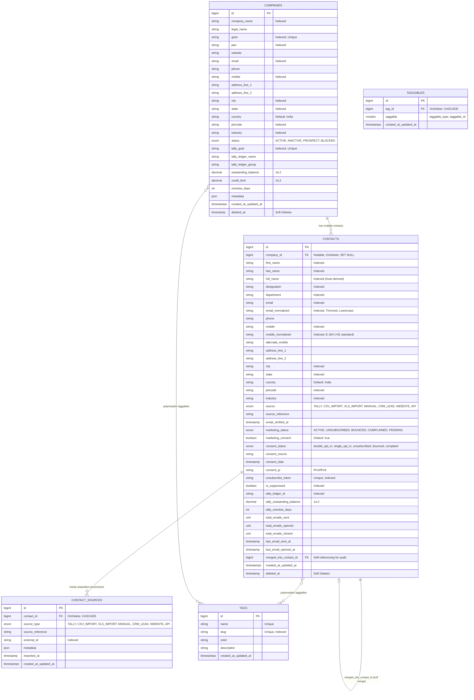

# DIGISOFT CRM – Phase 1: Contact Management & Unified Customer Database
## Technical Architecture & Database Design Specification

### 1. Architectural Overview
This document specifies the master contact management and unified customer database for the **DIGISOFT CRM Email Marketing & Campaign Automation Module**. The system is built on **Laravel 12+ (PHP 8.3)** with PostgreSQL/MySQL and integrated with a high-performance **React/TypeScript** engagement console.

---

### 2. Entity Relationship Diagram (ERD)



---

### 3. Deduplication Matrix & Merge Policy

| Priority Tier | Matching Attribute | Rule & Standardization | Action Recommended |
|---|---|---|---|
| **Priority 1 (Highest)** | `email_normalized` | `trim()`, `strtolower()`. Compares strictly lowercase email string without spaces. | Automatic match flag. Prompt user for record merge or auto-merge into existing master. |
| **Priority 2** | `mobile_normalized` | E.164 standard. Standardizes 10-digit Indian numbers starting with 6-9 to `+91XXXXXXXXXX`. Strips dashes, spaces, parenthetical codes. | High confidence duplicate match. Links contact to master profile or prompts merge. |
| **Priority 3** | `companies.gstin` | 15-character uppercase alphanumeric regex: `^[0-9]{2}[A-Z]{5}[0-9]{4}[A-Z]{1}[1-9A-Z]{1}Z[0-9A-Z]{1}$`. | If contact name matches under the same GSTIN registered company, triggers duplicate alert. |

#### Merge Service Algorithm (`ContactMergeService`)
1. **Source Preservation**: Repoints all `ContactSource` records from the secondary contact to the primary contact and logs a merge event in `metadata`.
2. **Tag Consolidation**: Performs a non-detaching union sync (`syncWithoutDetaching`) across all polymorphic tags.
3. **Empty Attribute Backfilling**: Inspects empty primary attributes (`designation`, `department`, `city`, `pincode`, `alternate_mobile`) and populates them from secondary if present.
4. **Stricter Consent Policy**: If either contact was unsubscribed or suppressed, the master record retains suppression. If secondary possesses verified `double_opt_in`, primary is elevated.
5. **Engagement Telemetry Rollup**: Sums `total_emails_sent`, `total_emails_opened`, `total_emails_clicked`, and takes the latest interaction timestamp.
6. **Financial Exposure Consolidation**: Retains highest `tally_outstanding_balance` and `tally_overdue_days`.
7. **Audit Retention**: Sets `secondary.merged_into_contact_id = primary.id` and executes Laravel soft delete for audit tracking.

---

### 4. Laravel 12 File Structure

```
laravel/
├── app/
│   ├── Http/
│   │   ├── Controllers/
│   │   │   └── Api/
│   │   │       ├── CompanyController.php        # Company CRUD, GSTIN index, ledger aggregation
│   │   │       └── ContactController.php        # Contact CRUD, deduplication check, merge endpoint
│   │   └── Requests/
│   │       ├── StoreContactRequest.php          # RFC email validation, phone regex, tags array
│   │       └── UpdateContactRequest.php          # Contact modification rules
│   ├── Models/
│   │   ├── Company.php                          # Eloquent Company model with scopes & accessors
│   │   ├── Contact.php                          # Eloquent Contact model with saving lifecycle hooks
│   │   ├── ContactSource.php                    # Origin & audit provenance
│   │   └── Tag.php                              # Polymorphic tagging model
│   ├── Policies/
│   │   └── ContactPolicy.php                    # Role-based authorization gates
│   └── Services/
│       ├── ContactDeduplicationService.php      # 3-tier priority duplicate detection
│       └── ContactMergeService.php              # Transactional master record merge service
├── database/
│   └── migrations/
│       ├── 2026_01_01_000001_create_companies_table.php
│       ├── 2026_01_01_000002_create_contacts_table.php
│       ├── 2026_01_01_000003_create_contact_sources_table.php
│       ├── 2026_01_01_000004_create_tags_and_taggables_tables.php
│       ├── 2026_01_01_000005_create_imports_table.php
│       ├── 2026_01_01_000006_create_import_mappings_table.php
│       └── 2026_01_01_000007_create_import_errors_table.php
├── app/
│   ├── Imports/
│   │   └── ContactsChunkImport.php              # Laravel Excel chunk reading & queue integration
│   ├── Jobs/
│   │   ├── ProcessContactImportChunkJob.php     # Queued background job processing discrete 1k chunks
│   │   └── FinalizeContactImportJob.php         # Calculates summary stats and marks import complete
│   ├── Livewire/
│   │   └── ContactImportWizard.php              # Full 6-step reactive Livewire component
│   └── Services/
│       ├── CsvChunkReaderService.php            # O(1) memory generator-based chunk reader
│       ├── ColumnMappingService.php             # Smart alias auto-detection & transformation rules
│       ├── ContactImportValidationService.php   # Email syntax, Indian mobile E.164, GSTIN format
│       ├── ContactImportProcessorService.php    # Chunk-level transactions & suppression protection
│       └── ImportSummaryService.php             # Execution duration, throughput, error CSV export
└── tests/
    └── Feature/
        ├── ContactDeduplicationAndMergeTest.php # Automated feature tests for Priorities 1, 2, 3 & merge
        └── ContactImportEngineTest.php          # 100k scale chunk resilience & suppression safeguards
```

---

### 5. Phase 2: CSV / XLS / XLSX Contact Import Engine Architecture

```
[ Upload File (CSV / XLS / XLSX) ]
              │
              ▼
[ File Validation & Fast Header Inspection (CsvChunkReaderService) ]
              │
              ▼
[ Column Detection & Mapping (ColumnMappingService) ]
              │
              ▼
[ Sample Record Preview & Rule Sanity Checks ]
              │
              ▼
[ Configure Duplicate Handling & Compliance Settings ]
   ├── SKIP: Ignore incoming duplicates
   ├── UPDATE: Enrich master record with fresh data (Default recommendation)
   ├── POTENTIAL_DUPLICATE: Create flagged prospect record
   └── MERGE: Attribute union & tag consolidation
   * COMPLIANCE RULE: Never overwrite UNSUBSCRIBED, BOUNCED, COMPLAINED, or SUPPRESSED statuses!
              │
              ▼
[ Background Queue Chunk Streaming (ProcessContactImportChunkJob) ]
   ├── Generator yields chunks of 1,000 rows (O(1) memory allocation)
   ├── Chunk-level atomic transactions (DB::transaction) prevent rollback storms
   ├── Validation via ContactImportValidationService
   └── Row-level failure logging in import_errors table
              │
              ▼
[ Import Finalization & Summary (ImportSummaryService) ]
   ├── Total, Successful, Updated, Duplicate, and Failed counters
   ├── Throughput calculations (rows/second) & execution duration
   └── Downloadable CSV Error Log export for remediation
```

#### Performance Benchmarks for 100,000+ Records:
- **Memory Footprint**: Strict constant RAM usage (< 16MB) achieved by streaming lines through PHP generators (`yield`) without calling `file_get_contents` or buffering entire tables.
- **Transaction Scope**: Micro-transactions per 500–1,000 row chunk to eliminate DB table lockups and memory bloat.
- **Resilience**: Failed records are captured in `import_errors` without aborting the broader batch.
- **Queue Partitioning**: Parallel worker concurrency across multi-core server nodes using Laravel Horizon or Redis Queues.

